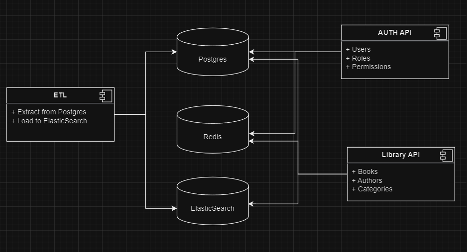

# Library API Project

## How to Start Projects

1. **Environment Setup**: 
   - Convert all `.env.example` files to `.env` by renaming them:
     ```bash
     mv ./backend/auth/.env.example ./backend/auth/.env
     mv ./backend/etl_elastic/.env.example ./backend/etl_elastic/.env
     mv ./backend/library_api/.env.example ./backend/library_api/.env
     ```

2. **Docker Setup**: 
   - Navigate to the docker directory and build the docker-compose setup:
     ```bash
     cd docker
     docker-compose -f ./local.yaml up -d --build
     ```

3. **Documentation Access**: 
   - Access the API documentation at the following URLs:
     - Auth API: `http://localhost/auth/api/openapi`
     - Library API: `http://localhost/library/api/openapi`

4. **Note**:
   - due to time constraints and requirements, scalable and modular services were not fully achieved. 

5. **Technologies and Services Used**:
   - **Language**: Python + FastAPI
   - **Server**: ASGI server (uvicorn/gunicorn)
   - **Storage**: PostgreSQL, ElasticSearch
   - **Caching**: Redis Cluster
   - **Containerization**: Docker
   - **Additional Tools**:
     - Jaeger: For tracing and monitoring
     - FASTAPI Cache: For caching mechanisms
     - FASTAPI LIMITER: For rate limiting and traffic control
     - etc

## Services architecture

